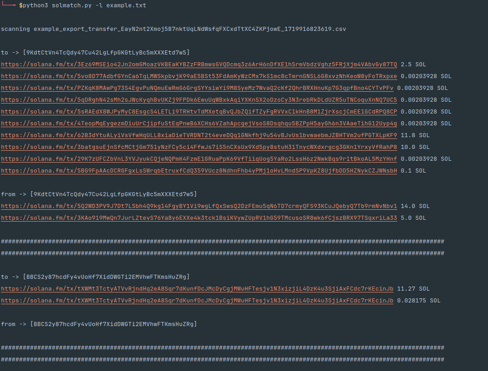

# SolMatch - v1.0
SolMatch is a simple tool to help you find all transactions between two or multiple wallets on Solana.

useful for scanning a wallet against multiple other wallets in bulk to quickly identify linked wallets of a user. Everything runs locally no need for API keys !



## Installation
1. clone the repo and cd into the directory
``` 
git clone https://github.com/

cd SolMatch
```
2. make and activate a python venv (recommended)
```
python3 -m venv venv
```
```
source venv/bin/activate
```
3. install the required dependency (pandas)
```
pip install pandas
```
## Usage
1. add the CSV file of a solana wallets txn history from solscan you want to scan against into the directory
2. if you want to scan against a list of wallets add a txt file with every wallet (one per line) to the directory
```
32hdrT5gU9SkbeDAzZ5am1j6QJzcMrZu2SwvkUfVXjJr
AWCiRj4ZQLhyiFo3qcBSxKH4NbecFyARkBiotao6vGM
7MHiUNyxZjHHzc5YHukCq7JRspVK85R8CmTxCrJuxdcv
9AaDsukhf9F8iCmuVywZn5Qjc54KGRz9dwek3WLUxArY

#example ^^^^^^^ example.txt
```
3. use -s to scan against one wallet | use -l to scan against a list in a .txt
```
python3 solmatch.py -s {wallet address}

python3 solmatch.py -l {.txt file of list}
```
### this will print you every hit with a 'to' or 'from' for the according wallet with a link to the transaction on-chain ! 